# Polyglot Codebase Knowledge Graph

> Generated offline by **readmenator**. 9 files, 153 symbols, 51 imports. Supports C, C++, Python, Go, Rust, JS/TS, Java, C#, Shell, PHP, Dart, GDScript, Nim, ASM, Ruby, Swift, Kotlin, Scala, Lua, Elixir.
> No LLMs. No tokens. Pure static analysis. See more [here](https://github.com/grisuno/ReadMenator)

**Start here:** Statistics Dashboard for scope, God Nodes for blast radius, Architecture Reference for per-file API. Agents: prefer `readmenator-agent/INDEX.md` + `SYMBOLS.md`.

**Wiki:** prefer `readmenator-wiki/index.md` for progressive disclosure: one synthesis page per community, `connections.json` with EXTRACTED vs INFERRED confidence, `queries.md` log, `REPORT.md` audit.

**Confidence:** EXTRACTED = parsed from source, INFERRED = heuristic bridge, AMBIGUOUS = reported, never hidden. See `readmenator-wiki/REPORT.md`.

**Total Files Parsed:** 9 | **Total Symbols Extracted:** 153 | **Total Imports:** 51
 | **Resolved Imports:** 7

<!-- ranking_model: v1.0 | weights: {ppr:0.45,auth:0.2,test:0.15,doc:0.1,fresh:0.1} | alpha:0.85 | commit:05a4468 | date:2026-07-18 -->


## Table of Contents

1. [Statistics Dashboard](#statistics-dashboard)
2. [Architectural Layers](#architectural-layers)
3. [Ranked Context](#ranked-context)
4. [God Nodes](#god-nodes)
5. [Community Analysis](#community-analysis)
6. [Suggested Questions](#suggested-questions)
7. [Taint Propagation Map](#taint-propagation-map)
8. [Hotspot Analysis](#hotspot-analysis)
9. [Change Impact Analysis](#change-impact-analysis)
10. [Architecture Violations](#architecture-violations)
11. [Suggested Linting Rules](#suggested-linting-rules)
12. [Query Recipes](#query-recipes)
13. [Structural Knowledge Map](#structural-knowledge-map)
14. [UML Class Diagram](#uml-class-diagram)
15. [Code Property Graph](#code-property-graph)
16. [Architecture Reference](#architecture-reference)
    - [PY (8 files)](#py-8-files)
    - [SH (1 files)](#sh-1-files)

---

## Statistics Dashboard

| Metric | Value |
|--------|-------|
| Total Files | 9 |
| Total Symbols | 153 |
| Total Imports | 51 |
| Call Edges | 854 |
| Inheritance Edges | 4 |
| Languages | 2 |
| Avg Symbols/File | 17.0 |
| Avg Imports/File | 5.7 |
| Resolved Imports | 7 |

### Top Files by Import Count (Fan-Out)

| File | Imports | Symbols | Language |
|------|---------|---------|----------|
| `lazyown_infinitestorage.py` | 19 | 78 | py |
| `tools.py` | 11 | 5 | py |
| `test_integration.py` | 9 | 16 | py |
| `test_frames.py` | 3 | 13 | py |
| `test_security.py` | 3 | 18 | py |
| `test_error_correction.py` | 2 | 10 | py |
| `test_protocols.py` | 2 | 12 | py |
| `wsgi_app.py` | 2 | 1 | py |

---

## Architectural Layers

Auto-detected from path patterns, naming conventions, and imported frameworks.

| Layer | Files |
|-------|-------|
| testing | 5 |
| utility | 3 |
| presentation | 1 |

### utility

- `install.sh` (sh, 0 symbols)
- `tools.py` (py, 5 symbols)
- `wsgi_app.py` (py, 1 symbols)

### presentation

- `lazyown_infinitestorage.py` (py, 78 symbols)

### testing

- `test_error_correction.py` (py, 10 symbols)
- `test_frames.py` (py, 13 symbols)
- `test_integration.py` (py, 16 symbols)
- `test_protocols.py` (py, 12 symbols)
- `test_security.py` (py, 18 symbols)

---

## Ranked Context

Files ranked by composite score for the current query context. The ranking combines Personalized PageRank (query relevance), global authority, test coverage, documentation coverage, and code freshness. Model: v1.0.

| Rank | File | Composite | PPR | Authority | Test | Doc |
|------|------|-----------|-----|-----------|------|-----|
| 1 | `lazyown_infinitestorage.py` | 0.3713 | 0.4982 | 0.4982 | 0.00 | 0.47 |
| 2 | `wsgi_app.py` | 0.2466 | 0.0717 | 0.0717 | 0.00 | 2.00 |
| 3 | `tools.py` | 0.1666 | 0.0717 | 0.0717 | 0.00 | 1.20 |
| 4 | `install.sh` | 0.1000 | 0.0000 | 0.0000 | 0.00 | 1.00 |
| 5 | `test_protocols.py` | 0.0716 | 0.0717 | 0.0717 | 0.00 | 0.25 |
| 6 | `test_frames.py` | 0.0697 | 0.0717 | 0.0717 | 0.00 | 0.23 |
| 7 | `test_error_correction.py` | 0.0666 | 0.0717 | 0.0717 | 0.00 | 0.20 |
| 8 | `test_integration.py` | 0.0653 | 0.0717 | 0.0717 | 0.00 | 0.19 |
| 9 | `test_security.py` | 0.0633 | 0.0717 | 0.0717 | 0.00 | 0.17 |

---

## God Nodes

Most architecturally central files ranked by combined import/export degree and symbol richness.

| File | Score | Connections | PageRank |
|------|-------|-------------|----------|
| `lazyown_infinitestorage.py` | 21.8 | | 0.4982 |
| `test_security.py` | 3.8 | | 0.0717 |
| `test_integration.py` | 3.6 | | 0.0717 |
| `test_frames.py` | 3.3 | | 0.0717 |
| `test_protocols.py` | 3.2 | | 0.0717 |
| `test_error_correction.py` | 3.0 | | 0.0717 |
| `tools.py` | 2.5 | | 0.0717 |
| `wsgi_app.py` | 2.1 | | 0.0717 |
| `install.sh` | 0.0 | | 0.0000 |

---

## Community Analysis

Files grouped by import-based community detection. Cohesion measures how tightly connected each community is internally.

### root (Cohesion: 1.00)

**8 files** in this community:

- `lazyown_infinitestorage.py` (py, 78 symbols)
- `tools.py` (py, 5 symbols)
- `test_error_correction.py` (py, 10 symbols)
- `test_frames.py` (py, 13 symbols)
- `test_integration.py` (py, 16 symbols)
- `test_protocols.py` (py, 12 symbols)
- `test_security.py` (py, 18 symbols)
- `wsgi_app.py` (py, 1 symbols)

---

## Suggested Questions

Auto-generated exploration prompts based on graph structure:

- What does lazyown_infinitestorage.py depend on, and what depends on it? (7 connections)
- What does test_security.py depend on, and what depends on it? (1 connections)
- What does test_integration.py depend on, and what depends on it? (1 connections)
- How are the 8 files in 'root' related to each other?
- What is LazyOwnConfig in lazyown_infinitestorage.py and how is it used?

---

## Taint Propagation Map

Taint analysis traces how dangerous imports propagate through the codebase via transitive dependencies. Source files import dangerous modules directly; sink files receive the danger indirectly.

**Taint Sources:** 3 | **Taint Sinks:** 3 | **Propagation Paths:** 5

- `lazyown_infinitestorage.py` imports `subprocess` (0 hop to `lazyown_infinitestorage.py`) [high]
  Path: lazyown_infinitestorage.py
- `tools.py` imports `subprocess` (0 hop to `tools.py`) [high]
  Path: tools.py
- `tools.py` imports `subprocess` (1 hop to `lazyown_infinitestorage.py`) [high]
  Path: tools.py -> lazyown_infinitestorage.py
- `test_integration.py` imports `subprocess` (0 hop to `test_integration.py`) [high]
  Path: test_integration.py
- `test_integration.py` imports `subprocess` (1 hop to `lazyown_infinitestorage.py`) [high]
  Path: test_integration.py -> lazyown_infinitestorage.py

---

## Hotspot Analysis

Files ranked by combined complexity (symbol count) and centrality (connection count). High-scoring files are architecturally critical and may need refactoring attention.

| File | Complexity | Centrality | Combined | Symbols | Connections |
|------|-----------|------------|----------|---------|-------------|
| `lazyown_infinitestorage.py` | 1.000 | 1.000 | 1.000 | 78 | 26 |
| `wsgi_app.py` | 0.013 | 0.115 | 0.074 | 1 | 3 |
| `tools.py` | 0.064 | 0.462 | 0.303 | 5 | 12 |
| `install.sh` | 0.000 | 0.000 | 0.000 | 0 | 0 |
| `test_protocols.py` | 0.154 | 0.115 | 0.131 | 12 | 3 |
| `test_frames.py` | 0.167 | 0.154 | 0.159 | 13 | 4 |
| `test_error_correction.py` | 0.128 | 0.115 | 0.120 | 10 | 3 |
| `test_integration.py` | 0.205 | 0.385 | 0.313 | 16 | 10 |
| `test_security.py` | 0.231 | 0.154 | 0.185 | 18 | 4 |

---

## Change Impact Analysis

Files sorted by how many other files would be affected if they changed. High-impact files should be changed with caution.

| File | Direct Dependents | Transitive Dependents | Total Impact |
|------|------------------|----------------------|--------------|
| `lazyown_infinitestorage.py` | 7 | 0 | 7 |
| `install.sh` | 0 | 0 | 0 |
| `tools.py` | 0 | 0 | 0 |
| `test_error_correction.py` | 0 | 0 | 0 |
| `test_frames.py` | 0 | 0 | 0 |
| `test_integration.py` | 0 | 0 | 0 |
| `test_protocols.py` | 0 | 0 | 0 |
| `test_security.py` | 0 | 0 | 0 |
| `wsgi_app.py` | 0 | 0 | 0 |

---

## Architecture Violations

Violations of architectural layer rules detected in the import graph. **5 strict violations, 0 warnings.**

| Source | Source Layer | Target | Target Layer | Description | Severity |
|--------|-------------|--------|-------------|-------------|----------|
| `test_error_correction.py` | testing | `lazyown_infinitestorage.py` | presentation | testing must not import presentation | strict |
| `test_frames.py` | testing | `lazyown_infinitestorage.py` | presentation | testing must not import presentation | strict |
| `test_integration.py` | testing | `lazyown_infinitestorage.py` | presentation | testing must not import presentation | strict |
| `test_protocols.py` | testing | `lazyown_infinitestorage.py` | presentation | testing must not import presentation | strict |
| `test_security.py` | testing | `lazyown_infinitestorage.py` | presentation | testing must not import presentation | strict |

---

## Suggested Linting Rules

Automatically suggested linting and security rules based on patterns detected in the codebase. These can be exported as Semgrep rules using the `--export-rules` flag.

| Rule ID | Severity | Description | Language | Matches |
|---------|----------|-------------|----------|---------|
| `RM001` | info | Large number of functions in py: 128 total | py | 128 |
| `RM002` | info | Print statement found (consider logging instead) | python | 7 |

---

## Query Recipes

Example queries you can run against this knowledge base using the ranking engine:

```
# Find files most relevant to a concept
readmenator query "Where is the import resolver implemented?"

# Rank files by relevance to a topic
readmenator query "How does documentation generation work?"

# Explain why a file ranks highly
readmenator query "explain readmenator/_documentation.py"

# Trace dependency paths with ranked context
readmenator query "path from CLI to exporter"
```

The ranking model uses the following signals:

- **Personalized PageRank** (45% weight): query-specific relevance via seed propagation
- **Global Authority** (20% weight): structural importance via standard PageRank
- **Test Coverage** (15% weight): fraction of symbols referenced in test files
- **Doc Coverage** (10% weight): presence of docstrings and file-level docs
- **Freshness** (10% weight): recent modification activity

Results include score decomposition and justification paths for each ranked item.

---

## Structural Knowledge Map

```mermaid
graph TD
    classDef mod fill:#1e1e1e,stroke:#ff6666,stroke-width:2px,color:#fff;
    classDef cls fill:#2d2d2d,stroke:#4ec9b0,stroke-width:2px,color:#fff;
    classDef fn fill:#333,stroke:#dcdcaa,stroke-width:1px,color:#dcdcaa;
    classDef ext fill:#111,stroke:#666,stroke-dasharray:5 5,color:#aaa;
    subgraph community_0 ["root"]
    lazyown_infinitestorage_py["lazyown_infinitestorage.py (py)"]
    class lazyown_infinitestorage_py mod;
    lazyown_infinitestorage_py_LazyOwnConfig["LazyOwnConfig"]
    class lazyown_infinitestorage_py_LazyOwnConfig cls;
    lazyown_infinitestorage_py --> lazyown_infinitestorage_py_LazyOwnConfig
    lazyown_infinitestorage_py_SecurityValidator["SecurityValidator"]
    class lazyown_infinitestorage_py_SecurityValidator cls;
    lazyown_infinitestorage_py --> lazyown_infinitestorage_py_SecurityValidator
    lazyown_infinitestorage_py_ErrorCorrector["ErrorCorrector"]
    class lazyown_infinitestorage_py_ErrorCorrector cls;
    lazyown_infinitestorage_py --> lazyown_infinitestorage_py_ErrorCorrector
    lazyown_infinitestorage_py_FrameEncoder["FrameEncoder"]
    class lazyown_infinitestorage_py_FrameEncoder cls;
    lazyown_infinitestorage_py --> lazyown_infinitestorage_py_FrameEncoder
    lazyown_infinitestorage_py_FrameDecoder["FrameDecoder"]
    class lazyown_infinitestorage_py_FrameDecoder cls;
    lazyown_infinitestorage_py --> lazyown_infinitestorage_py_FrameDecoder
    skill_lazyown_infinitestorage_tools_py["tools.py (py)"]
    class skill_lazyown_infinitestorage_tools_py mod;
    tests_test_integration_py["test_integration.py (py)"]
    class tests_test_integration_py mod;
    tests_test_security_py["test_security.py (py)"]
    class tests_test_security_py mod;
    tests_test_frames_py["test_frames.py (py)"]
    class tests_test_frames_py mod;
    tests_test_protocols_py["test_protocols.py (py)"]
    class tests_test_protocols_py mod;
    tests_test_error_correction_py["test_error_correction.py (py)"]
    class tests_test_error_correction_py mod;
    wsgi_app_py["wsgi_app.py (py)"]
    class wsgi_app_py mod;
    install_sh["install.sh (sh)"]
    class install_sh mod;
    end
    skill_lazyown_infinitestorage_tools_py -- resolved_imports --> lazyown_infinitestorage_py
    tests_test_error_correction_py -- resolved_imports --> lazyown_infinitestorage_py
    tests_test_frames_py -- resolved_imports --> lazyown_infinitestorage_py
    tests_test_integration_py -- resolved_imports --> lazyown_infinitestorage_py
    tests_test_protocols_py -- resolved_imports --> lazyown_infinitestorage_py
    tests_test_security_py -- resolved_imports --> lazyown_infinitestorage_py
    wsgi_app_py -- resolved_imports --> lazyown_infinitestorage_py
    ext_argparse["argparse"]
    class ext_argparse ext;
    lazyown_infinitestorage_py -.->|imports| ext_argparse
    ext_binascii["binascii"]
    class ext_binascii ext;
    lazyown_infinitestorage_py -.->|imports| ext_binascii
    ext_math["math"]
    class ext_math ext;
    lazyown_infinitestorage_py -.->|imports| ext_math
    ext_os["os"]
    class ext_os ext;
    lazyown_infinitestorage_py -.->|imports| ext_os
    ext_re["re"]
    class ext_re ext;
    lazyown_infinitestorage_py -.->|imports| ext_re
    ext_struct["struct"]
    class ext_struct ext;
    lazyown_infinitestorage_py -.->|imports| ext_struct
    ext_subprocess["subprocess"]
    class ext_subprocess ext;
    lazyown_infinitestorage_py -.->|imports| ext_subprocess
    ext_sys["sys"]
    class ext_sys ext;
    lazyown_infinitestorage_py -.->|imports| ext_sys
    ext_tempfile["tempfile"]
    class ext_tempfile ext;
    lazyown_infinitestorage_py -.->|imports| ext_tempfile
    ext_hashlib["hashlib"]
    class ext_hashlib ext;
    lazyown_infinitestorage_py -.->|imports| ext_hashlib
    ext_random["random"]
    class ext_random ext;
    lazyown_infinitestorage_py -.->|imports| ext_random
    ext_shutil["shutil"]
    class ext_shutil ext;
    lazyown_infinitestorage_py -.->|imports| ext_shutil
    ext_typing["typing"]
    class ext_typing ext;
    lazyown_infinitestorage_py -.->|imports| ext_typing
    ext_cv2["cv2"]
    class ext_cv2 ext;
    lazyown_infinitestorage_py -.->|imports| ext_cv2
    ext_numpy["numpy"]
    class ext_numpy ext;
    lazyown_infinitestorage_py -.->|imports| ext_numpy
    ext_flask["flask"]
    class ext_flask ext;
    lazyown_infinitestorage_py -.->|imports| ext_flask
    ext_PyQt5_QtWidgets["PyQt5.QtWidgets"]
    class ext_PyQt5_QtWidgets ext;
    lazyown_infinitestorage_py -.->|imports| ext_PyQt5_QtWidgets
    ext_PyQt5_QtCore["PyQt5.QtCore"]
    class ext_PyQt5_QtCore ext;
    lazyown_infinitestorage_py -.->|imports| ext_PyQt5_QtCore
    ext_json["json"]
    class ext_json ext;
    lazyown_infinitestorage_py -.->|imports| ext_json
    skill_lazyown_infinitestorage_tools_py -.->|imports| ext_os
    skill_lazyown_infinitestorage_tools_py -.->|imports| ext_sys
    skill_lazyown_infinitestorage_tools_py -.->|imports| ext_subprocess
    ext_time["time"]
    class ext_time ext;
    skill_lazyown_infinitestorage_tools_py -.->|imports| ext_time
    skill_lazyown_infinitestorage_tools_py -.->|imports| ext_typing
    ext_lazyown_infinitestorage["lazyown_infinitestorage"]
    class ext_lazyown_infinitestorage ext;
    skill_lazyown_infinitestorage_tools_py -.->|imports| ext_lazyown_infinitestorage
    ext_selenium["selenium"]
    class ext_selenium ext;
    skill_lazyown_infinitestorage_tools_py -.->|imports| ext_selenium
    ext_selenium_webdriver_common_by["selenium.webdriver.common.by"]
    class ext_selenium_webdriver_common_by ext;
    skill_lazyown_infinitestorage_tools_py -.->|imports| ext_selenium_webdriver_common_by
    ext_selenium_webdriver_support_ui["selenium.webdriver.support.ui"]
    class ext_selenium_webdriver_support_ui ext;
    skill_lazyown_infinitestorage_tools_py -.->|imports| ext_selenium_webdriver_support_ui
    ext_selenium_webdriver_support["selenium.webdriver.support"]
    class ext_selenium_webdriver_support ext;
    skill_lazyown_infinitestorage_tools_py -.->|imports| ext_selenium_webdriver_support
    ext_selenium_webdriver_chrome_service["selenium.webdriver.chrome.service"]
    class ext_selenium_webdriver_chrome_service ext;
    skill_lazyown_infinitestorage_tools_py -.->|imports| ext_selenium_webdriver_chrome_service
    ext_pytest["pytest"]
    class ext_pytest ext;
    tests_test_error_correction_py -.->|imports| ext_pytest
    tests_test_error_correction_py -.->|imports| ext_lazyown_infinitestorage
    tests_test_frames_py -.->|imports| ext_numpy
    tests_test_frames_py -.->|imports| ext_pytest
    tests_test_frames_py -.->|imports| ext_lazyown_infinitestorage
    tests_test_integration_py -.->|imports| ext_hashlib
    tests_test_integration_py -.->|imports| ext_os
    tests_test_integration_py -.->|imports| ext_random
    tests_test_integration_py -.->|imports| ext_subprocess
    tests_test_integration_py -.->|imports| ext_tempfile
    tests_test_integration_py -.->|imports| ext_pytest
    tests_test_integration_py -.->|imports| ext_lazyown_infinitestorage
    ext_io["io"]
    class ext_io ext;
    tests_test_integration_py -.->|imports| ext_io
    tests_test_integration_py -.->|imports| ext_io
    tests_test_protocols_py -.->|imports| ext_pytest
    tests_test_protocols_py -.->|imports| ext_lazyown_infinitestorage
    tests_test_security_py -.->|imports| ext_os
    tests_test_security_py -.->|imports| ext_pytest
    tests_test_security_py -.->|imports| ext_lazyown_infinitestorage
    wsgi_app_py -.->|imports| ext_os
    wsgi_app_py -.->|imports| ext_lazyown_infinitestorage
```



---

## UML Class Diagram

Auto-generated Mermaid class diagram from parsed class-level symbols. Shows classes, structs, interfaces, traits, and their methods with inheritance and dependency relationships.


---

## Code Property Graph

Machine-readable Code Property Graph (CPG) in JSON-LD format. This block allows AI agents to parse the full structural graph without additional file reads. Compatible with GraphRAG pipelines.

```json
{"@context": "https://schema.org", "analysis": {"communities": [{"cohesion": 1.0, "id": 0, "label": "tests", "size": 8}], "god_nodes": [{"node_id": "lazyown_infinitestorage.py", "score": 21.8}, {"node_id": "tests/test_security.py", "score": 3.8}, {"node_id": "tests/test_integration.py", "score": 3.6}, {"node_id": "tests/test_frames.py", "score": 3.3}, {"node_id": "tests/test_protocols.py", "score": 3.2}, {"node_id": "tests/test_error_correction.py", "score": 3.0}, {"node_id": "skill_lazyown_infinitestorage/tools.py", "score": 2.5}, {"node_id": "wsgi_app.py", "score": 2.1}, {"node_id": "install.sh", "score": 0.0}], "surprising_connections": []}, "edges": [{"confidence": "EXTRACTED", "relation": "imports", "source": "lazyown_infinitestorage.py", "target": "argparse"}, {"confidence": "EXTRACTED", "relation": "imports", "source": "lazyown_infinitestorage.py", "target": "binascii"}, {"confidence": "EXTRACTED", "relation": "imports", "source": "lazyown_infinitestorage.py", "target": "math"}, {"confidence": "EXTRACTED", "relation": "imports", "source": "lazyown_infinitestorage.py", "target": "os"}, {"confidence": "EXTRACTED", "relation": "imports", "source": "lazyown_infinitestorage.py", "target": "re"}, {"confidence": "EXTRACTED", "relation": "imports", "source": "lazyown_infinitestorage.py", "target": "struct"}, {"confidence": "EXTRACTED", "relation": "imports", "source": "lazyown_infinitestorage.py", "target": "subprocess"}, {"confidence": "EXTRACTED", "relation": "imports", "source": "lazyown_infinitestorage.py", "target": "sys"}, {"confidence": "EXTRACTED", "relation": "imports", "source": "lazyown_infinitestorage.py", "target": "tempfile"}, {"confidence": "EXTRACTED", "relation": "imports", "source": "lazyown_infinitestorage.py", "target": "hashlib"}, {"confidence": "EXTRACTED", "relation": "imports", "source": "lazyown_infinitestorage.py", "target": "random"}, {"confidence": "EXTRACTED", "relation": "imports", "source": "lazyown_infinitestorage.py", "target": "shutil"}, {"confidence": "EXTRACTED", "relation": "imports", "source": "lazyown_infinitestorage.py", "target": "typing"}, {"confidence": "EXTRACTED", "relation": "imports", "source": "lazyown_infinitestorage.py", "target": "cv2"}, {"confidence": "EXTRACTED", "relation": "imports", "source": "lazyown_infinitestorage.py", "target": "numpy"}, {"confidence": "EXTRACTED", "relation": "imports", "source": "lazyown_infinitestorage.py", "target": "flask"}, {"confidence": "EXTRACTED", "relation": "imports", "source": "lazyown_infinitestorage.py", "target": "PyQt5.QtWidgets"}, {"confidence": "EXTRACTED", "relation": "imports", "source": "lazyown_infinitestorage.py", "target": "PyQt5.QtCore"}, {"confidence": "EXTRACTED", "relation": "imports", "source": "lazyown_infinitestorage.py", "target": "json"}, {"confidence": "EXTRACTED", "relation": "imports", "source": "skill_lazyown_infinitestorage/tools.py", "target": "os"}, {"confidence": "EXTRACTED", "relation": "imports", "source": "skill_lazyown_infinitestorage/tools.py", "target": "sys"}, {"confidence": "EXTRACTED", "relation": "imports", "source": "skill_lazyown_infinitestorage/tools.py", "target": "subprocess"}, {"confidence": "EXTRACTED", "relation": "imports", "source": "skill_lazyown_infinitestorage/tools.py", "target": "time"}, {"confidence": "EXTRACTED", "relation": "imports", "source": "skill_lazyown_infinitestorage/tools.py", "target": "typing"}, {"confidence": "EXTRACTED", "relation": "imports", "source": "skill_lazyown_infinitestorage/tools.py", "target": "lazyown_infinitestorage"}, {"confidence": "EXTRACTED", "relation": "imports", "source": "skill_lazyown_infinitestorage/tools.py", "target": "selenium"}, {"confidence": "EXTRACTED", "relation": "imports", "source": "skill_lazyown_infinitestorage/tools.py", "target": "selenium.webdriver.common.by"}, {"confidence": "EXTRACTED", "relation": "imports", "source": "skill_lazyown_infinitestorage/tools.py", "target": "selenium.webdriver.support.ui"}, {"confidence": "EXTRACTED", "relation": "imports", "source": "skill_lazyown_infinitestorage/tools.py", "target": "selenium.webdriver.support"}, {"confidence": "EXTRACTED", "relation": "imports", "source": "skill_lazyown_infinitestorage/tools.py", "target": "selenium.webdriver.chrome.service"}, {"confidence": "EXTRACTED", "relation": "imports", "source": "tests/test_error_correction.py", "target": "pytest"}, {"confidence": "EXTRACTED", "relation": "imports", "source": "tests/test_error_correction.py", "target": "lazyown_infinitestorage"}, {"confidence": "EXTRACTED", "relation": "imports", "source": "tests/test_frames.py", "target": "numpy"}, {"confidence": "EXTRACTED", "relation": "imports", "source": "tests/test_frames.py", "target": "pytest"}, {"confidence": "EXTRACTED", "relation": "imports", "source": "tests/test_frames.py", "target": "lazyown_infinitestorage"}, {"confidence": "EXTRACTED", "relation": "imports", "source": "tests/test_integration.py", "target": "hashlib"}, {"confidence": "EXTRACTED", "relation": "imports", "source": "tests/test_integration.py", "target": "os"}, {"confidence": "EXTRACTED", "relation": "imports", "source": "tests/test_integration.py", "target": "random"}, {"confidence": "EXTRACTED", "relation": "imports", "source": "tests/test_integration.py", "target": "subprocess"}, {"confidence": "EXTRACTED", "relation": "imports", "source": "tests/test_integration.py", "target": "tempfile"}, {"confidence": "EXTRACTED", "relation": "imports", "source": "tests/test_integration.py", "target": "pytest"}, {"confidence": "EXTRACTED", "relation": "imports", "source": "tests/test_integration.py", "target": "lazyown_infinitestorage"}, {"confidence": "EXTRACTED", "relation": "imports", "source": "tests/test_integration.py", "target": "io"}, {"confidence": "EXTRACTED", "relation": "imports", "source": "tests/test_integration.py", "target": "io"}, {"confidence": "EXTRACTED", "relation": "imports", "source": "tests/test_protocols.py", "target": "pytest"}, {"confidence": "EXTRACTED", "relation": "imports", "source": "tests/test_protocols.py", "target": "lazyown_infinitestorage"}, {"confidence": "EXTRACTED", "relation": "imports", "source": "tests/test_security.py", "target": "os"}, {"confidence": "EXTRACTED", "relation": "imports", "source": "tests/test_security.py", "target": "pytest"}, {"confidence": "EXTRACTED", "relation": "imports", "source": "tests/test_security.py", "target": "lazyown_infinitestorage"}, {"confidence": "EXTRACTED", "relation": "imports", "source": "wsgi_app.py", "target": "os"}, {"confidence": "EXTRACTED", "relation": "imports", "source": "wsgi_app.py", "target": "lazyown_infinitestorage"}, {"confidence": "EXTRACTED", "relation": "resolved_imports", "source": "skill_lazyown_infinitestorage/tools.py", "target": "lazyown_infinitestorage.py"}, {"confidence": "EXTRACTED", "relation": "resolved_imports", "source": "tests/test_error_correction.py", "target": "lazyown_infinitestorage.py"}, {"confidence": "EXTRACTED", "relation": "resolved_imports", "source": "tests/test_frames.py", "target": "lazyown_infinitestorage.py"}, {"confidence": "EXTRACTED", "relation": "resolved_imports", "source": "tests/test_integration.py", "target": "lazyown_infinitestorage.py"}, {"confidence": "EXTRACTED", "relation": "resolved_imports", "source": "tests/test_protocols.py", "target": "lazyown_infinitestorage.py"}, {"confidence": "EXTRACTED", "relation": "resolved_imports", "source": "tests/test_security.py", "target": "lazyown_infinitestorage.py"}, {"confidence": "EXTRACTED", "relation": "resolved_imports", "source": "wsgi_app.py", "target": "lazyown_infinitestorage.py"}], "generator": "readmenator", "metadata": {"edge_count": 916, "file_count": 9, "language_count": 2, "symbol_count": 153}, "nodes": [{"doc": "Verificar si Python está instalado", "id": "install.sh", "kind": "module", "label": "install.sh", "language": "sh", "sha256": "c907d80fd6734993", "symbol_count": 0, "symbols": []}, {"doc": "LazyOwnInfiniteStorage - Production-grade file-to-video encoder/decoder.", "id": "lazyown_infinitestorage.py", "kind": "module", "label": "lazyown_infinitestorage.py", "language": "py", "sha256": "24df7bb93ec0e25c", "symbol_count": 78, "symbols": [{"doc": "Centralized immutable configuration constants for LazyOwnInfiniteStorage.", "kind": "class", "line": 66, "name": "LazyOwnConfig", "signature": "class LazyOwnConfig"}, {"doc": "Validates file paths and inputs to prevent path traversal and abuse.", "kind": "class", "line": 143, "name": "SecurityValidator", "signature": "class SecurityValidator"}, {"doc": "Implements Hamming(8,4) extended error correction for byte streams.", "kind": "class", "line": 179, "name": "ErrorCorrector", "signature": "class ErrorCorrector"}, {"doc": "Encodes bit strings into numpy grayscale frames.", "kind": "class", "line": 237, "name": "FrameEncoder", "signature": "class FrameEncoder"}, {"doc": "Decodes grayscale frames into bit strings.", "kind": "class", "line": 268, "name": "FrameDecoder", "signature": "class FrameDecoder"}, {"doc": "Manages FFmpeg subprocess communication without intermediate frame files.", "kind": "class", "line": 300, "name": "FFmpegPipeline", "signature": "class FFmpegPipeline"}, {"doc": "Abstract base for encoding and decoding protocol implementations.", "kind": "class", "line": 390, "name": "ProtocolHandler", "signature": "class ProtocolHandler"}, {"doc": "Implements the original v1 protocol with filename-based resolution and end marker.", "kind": "class", "line": 402, "name": "LegacyProtocolHandler", "signature": "class LegacyProtocolHandler(ProtocolHandler)"}, {"doc": "Implements the v2 protocol with structured headers, CRC32, and Hamming error correction.", "kind": "class", "line": 427, "name": "SecureProtocolHandler", "signature": "class SecureProtocolHandler(ProtocolHandler)"}, {"doc": "Main orchestrator for encoding and decoding files to and from video.", "kind": "class", "line": 481, "name": "LazyOwnInfiniteStorage", "signature": "class LazyOwnInfiniteStorage"}, {"doc": "Command-line interface runner for LazyOwnInfiniteStorage.", "kind": "class", "line": 604, "name": "CLIRunner", "signature": "class CLIRunner"}, {"doc": "Executes built-in round-trip tests for both protocols.", "kind": "method", "line": 943, "name": "run_tests", "signature": "def run_tests()"}, {"doc": "Entry point for LazyOwnInfiniteStorage.", "kind": "method", "line": 991, "name": "main", "signature": "def main()"}, {"kind": "method", "line": 146, "name": "__init__", "signature": "def __init__(self, config)"}, {"doc": "Resolves and validates an absolute file path.", "kind": "method", "line": 149, "name": "validate_file_path", "signature": "def validate_file_path(self, file_path, must_exist)"}, {"doc": "Ensures the file size is within acceptable limits.", "kind": "method", "line": 159, "name": "validate_size", "signature": "def validate_size(self, size)"}, {"doc": "Sanitizes a filename to remove unsafe characters.", "kind": "method", "line": 164, "name": "sanitize_filename", "signature": "def sanitize_filename(self, filename)"}, {"doc": "Ensures the file extension is in the allowed set.", "kind": "method", "line": 172, "name": "validate_extension", "signature": "def validate_extension(self, file_path, allowed_extensions)"}, {"kind": "method", "line": 182, "name": "__init__", "signature": "def __init__(self, config)"}, {"doc": "Encodes a byte sequence using Hamming(8,4) correction.", "kind": "method", "line": 185, "name": "encode_data", "signature": "def encode_data(self, data)"}, {"doc": "Decodes a Hamming(8,4) encoded byte sequence with single-bit error correction.", "kind": "method", "line": 195, "name": "decode_data", "signature": "def decode_data(self, data)"}, {"kind": "method", "line": 206, "name": "_encode_nibble", "signature": "def _encode_nibble(self, nibble)"}, {"kind": "method", "line": 217, "name": "_decode_nibble", "signature": "def _decode_nibble(self, byte_val)"}, {"kind": "method", "line": 240, "name": "__init__", "signature": "def __init__(self, config)"}, {"doc": "Yields grayscale frames from a bit string.", "kind": "method", "line": 243, "name": "bits_to_frames", "signature": "def bits_to_frames(self, bit_string, frame_width, frame_height, block_size)"}, {"kind": "method", "line": 258, "name": "_create_frame", "signature": "def _create_frame(self, bits, width, height, block_size, blocks_per_row)"}, {"kind": "method", "line": 271, "name": "__init__", "signature": "def __init__(self, config)"}, {"doc": "Extracts a bit string from rawvideo grayscale bytes.", "kind": "method", "line": 274, "name": "extract_bits_from_raw_frames", "signature": "def extract_bits_from_raw_frames(self, raw_bytes, width, height, block_size, expected_bits)"}, {"kind": "method", "line": 303, "name": "__init__", "signature": "def __init__(self, config)"}, {"doc": "Retrieves native resolution and metadata from a video file.", "kind": "method", "line": 306, "name": "get_video_info", "signature": "def get_video_info(self, input_path)"}, {"doc": "Extracts custom lazyown metadata from a video file using ffprobe.", "kind": "method", "line": 320, "name": "get_metadata", "signature": "def get_metadata(self, input_path)"}, {"doc": "Encodes a generator of frames into a video file via FFmpeg stdin.", "kind": "method", "line": 339, "name": "encode_video", "signature": "def encode_video(self, frame_generator, output_path, frame_width, frame_height, fps)"}, {"doc": "Extracts raw grayscale frames from a video file via FFmpeg stdout.", "kind": "method", "line": 366, "name": "extract_raw_frames", "signature": "def extract_raw_frames(self, input_path, target_width, target_height, max_frames)"}, {"doc": "Packs raw data into a bit string.", "kind": "method", "line": 393, "name": "pack", "signature": "def pack(self, data, frame_width, frame_height, block_size, fps)"}, {"doc": "Unpacks a bit string into raw data.", "kind": "method", "line": 397, "name": "unpack", "signature": "def unpack(self, bit_string, block_size)"}, {"kind": "method", "line": 405, "name": "__init__", "signature": "def __init__(self, config)"}, {"kind": "method", "line": 408, "name": "pack", "signature": "def pack(self, data, frame_width, frame_height, block_size, fps)"}, {"kind": "method", "line": 413, "name": "unpack", "signature": "def unpack(self, bit_string, block_size)"}, {"kind": "method", "line": 430, "name": "__init__", "signature": "def __init__(self, config, corrector)"}, {"kind": "method", "line": 434, "name": "pack", "signature": "def pack(self, data, frame_width, frame_height, block_size, fps)"}, {"kind": "method", "line": 453, "name": "unpack", "signature": "def unpack(self, bit_string, block_size)"}, {"kind": "method", "line": 484, "name": "__init__", "signature": "def __init__(self, config)"}, {"doc": "Return a WebRunner for WSGI or local web server use.", "kind": "method", "line": 494, "name": "create_web_runner", "signature": "def create_web_runner(self)"}, {"doc": "Encodes a file into a video using the specified protocol.", "kind": "method", "line": 498, "name": "encode", "signature": "def encode(self, input_path, output_path, frame_width, frame_height, fps, block_size, protocol_version)"}, {"doc": "Decodes a video back into the original file using the specified protocol.", "kind": "method", "line": 523, "name": "decode", "signature": "def decode(self, input_path, output_path, block_size, protocol_version)"}, {"kind": "method", "line": 534, "name": "_validate_encoding_parameters", "signature": "def _validate_encoding_parameters(self, frame_width, frame_height, fps, block_size)"}, {"kind": "method", "line": 544, "name": "_detect_protocol", "signature": "def _detect_protocol(self, input_path, block_size)"}, {"kind": "method", "line": 577, "name": "_decode_legacy", "signature": "def _decode_legacy(self, input_path, output_path, block_size)"}, {"kind": "method", "line": 590, "name": "_decode_secure", "signature": "def _decode_secure(self, input_path, output_path, block_size)"}, {"kind": "method", "line": 607, "name": "__init__", "signature": "def __init__(self, storage)"}, {"kind": "method", "line": 610, "name": "run", "signature": "def run(self)"}, {"doc": "Background worker thread for non-blocking GUI operations.", "kind": "class", "line": 654, "name": "Worker", "signature": "class Worker(QThread)"}, {"doc": "PyQt5 graphical user interface for LazyOwnInfiniteStorage.", "kind": "class", "line": 673, "name": "GUIRunner", "signature": "class GUIRunner(QWidget)"}, {"doc": "Stub GUI runner when PyQt5 is unavailable.", "kind": "class", "line": 809, "name": "GUIRunner", "signature": "class GUIRunner"}, {"doc": "Flask web server interface for LazyOwnInfiniteStorage.", "kind": "class", "line": 820, "name": "WebRunner", "signature": "class WebRunner"}, {"doc": "Stub web runner when Flask is unavailable.", "kind": "class", "line": 933, "name": "WebRunner", "signature": "class WebRunner"}, {"kind": "method", "line": 660, "name": "__init__", "signature": "def __init__(self, func)"}, {"kind": "method", "line": 666, "name": "run", "signature": "def run(self)"}, {"kind": "method", "line": 676, "name": "__init__", "signature": "def __init__(self, storage)"}, {"kind": "method", "line": 682, "name": "_init_ui", "signature": "def _init_ui(self)"}, {"kind": "method", "line": 750, "name": "_change_mode", "signature": "def _change_mode(self)"}, {"kind": "method", "line": 761, "name": "_browse_input", "signature": "def _browse_input(self)"}, {"kind": "method", "line": 771, "name": "_start", "signature": "def _start(self)"}, {"kind": "method", "line": 794, "name": "_on_finished", "signature": "def _on_finished(self, message)"}, {"kind": "method", "line": 799, "name": "_on_error", "signature": "def _on_error(self, message)"}, {"kind": "method", "line": 804, "name": "run", "signature": "def run(self)"}, {"kind": "method", "line": 812, "name": "__init__", "signature": "def __init__(self, storage)"}, {"kind": "method", "line": 815, "name": "run", "signature": "def run(self)"}, {"kind": "method", "line": 823, "name": "__init__", "signature": "def __init__(self, storage)"}, {"doc": "Create directories and validate environment.", "kind": "method", "line": 834, "name": "run_setup", "signature": "def run_setup(self)"}, {"kind": "method", "line": 840, "name": "_setup_routes", "signature": "def _setup_routes(self)"}, {"kind": "method", "line": 928, "name": "run", "signature": "def run(self, host, port)"}, {"kind": "method", "line": 936, "name": "__init__", "signature": "def __init__(self, storage)"}, {"kind": "method", "line": 939, "name": "run", "signature": "def run(self, host, port)"}, {"kind": "method", "line": 845, "name": "_validate_upload", "signature": "def _validate_upload(input_file, action)"}, {"kind": "method", "line": 863, "name": "index", "signature": "def index()"}, {"kind": "method", "line": 908, "name": "download", "signature": "def download(filename)"}, {"kind": "method", "line": 916, "name": "add_security_headers", "signature": "def add_security_headers(response)"}]}, {"doc": "MCP tools for LazyOwnInfiniteStorage integration.", "id": "skill_lazyown_infinitestorage/tools.py", "kind": "module", "label": "tools.py", "language": "py", "sha256": "7bea6c8f21b6b1df", "symbol_count": 5, "symbols": [{"doc": "Encode a file into a video using LazyOwnInfiniteStorage.", "kind": "function", "line": 34, "name": "lazyown_infinitestorage_encode", "signature": "def lazyown_infinitestorage_encode(params)"}, {"doc": "Decode a video back into the original file using LazyOwnInfiniteStorage.", "kind": "function", "line": 101, "name": "lazyown_infinitestorage_decode", "signature": "def lazyown_infinitestorage_decode(params)"}, {"doc": "Upload a video to YouTube using browser automation.", "kind": "function", "line": 152, "name": "lazyown_infinitestorage_upload_to_youtube", "signature": "def lazyown_infinitestorage_upload_to_youtube(params)"}, {"doc": "Get a tool by name.", "kind": "function", "line": 302, "name": "get_tool", "signature": "def get_tool(name)"}, {"doc": "List all available tools.", "kind": "function", "line": 306, "name": "list_tools", "signature": "def list_tools()"}]}, {"doc": "Unit tests for ErrorCorrector Hamming(8,4) implementation.", "id": "tests/test_error_correction.py", "kind": "module", "label": "test_error_correction.py", "language": "py", "sha256": "b873018e8d2792f4", "symbol_count": 10, "symbols": [{"doc": "Specification: ErrorCorrector encodes bytes into Hamming(8,4) and corrects single-bit errors.", "kind": "class", "line": 7, "name": "TestErrorCorrector", "signature": "class TestErrorCorrector"}, {"kind": "method", "line": 11, "name": "setup", "signature": "def setup(self)"}, {"kind": "method", "line": 15, "name": "test_encode_data_doubles_length", "signature": "def test_encode_data_doubles_length(self)"}, {"kind": "method", "line": 20, "name": "test_decode_data_reverses_encoding", "signature": "def test_decode_data_reverses_encoding(self)"}, {"kind": "method", "line": 26, "name": "test_decode_data_with_single_bit_error", "signature": "def test_decode_data_with_single_bit_error(self)"}, {"kind": "method", "line": 33, "name": "test_decode_data_rejects_odd_length", "signature": "def test_decode_data_rejects_odd_length(self)"}, {"kind": "method", "line": 37, "name": "test_encode_nibble_all_values", "signature": "def test_encode_nibble_all_values(self)"}, {"kind": "method", "line": 42, "name": "test_decode_nibble_all_values", "signature": "def test_decode_nibble_all_values(self)"}, {"kind": "method", "line": 49, "name": "test_roundtrip_various_inputs", "signature": "def test_roundtrip_various_inputs(self, data)"}, {"kind": "method", "line": 55, "name": "test_single_bit_error_per_nibble", "signature": "def test_single_bit_error_per_nibble(self, nibble)"}]}, {"doc": "Unit tests for FrameEncoder and FrameDecoder.", "id": "tests/test_frames.py", "kind": "module", "label": "test_frames.py", "language": "py", "sha256": "4d1ebb4f001ebc51", "symbol_count": 13, "symbols": [{"doc": "Specification: FrameEncoder converts bit strings into grayscale frames.", "kind": "class", "line": 8, "name": "TestFrameEncoder", "signature": "class TestFrameEncoder"}, {"doc": "Specification: FrameDecoder extracts bit strings from rawvideo grayscale bytes.", "kind": "class", "line": 54, "name": "TestFrameDecoder", "signature": "class TestFrameDecoder"}, {"kind": "method", "line": 12, "name": "setup", "signature": "def setup(self)"}, {"kind": "method", "line": 16, "name": "test_bits_to_frames_yields_correct_number_of_frames", "signature": "def test_bits_to_frames_yields_correct_number_of_frames(self)"}, {"kind": "method", "line": 28, "name": "test_each_frame_has_correct_dimensions", "signature": "def test_each_frame_has_correct_dimensions(self)"}, {"kind": "method", "line": 33, "name": "test_bit_one_produces_white_block", "signature": "def test_bit_one_produces_white_block(self)"}, {"kind": "method", "line": 38, "name": "test_bit_zero_produces_black_block", "signature": "def test_bit_zero_produces_black_block(self)"}, {"kind": "method", "line": 43, "name": "test_padding_zeros_fill_incomplete_frame", "signature": "def test_padding_zeros_fill_incomplete_frame(self)"}, {"kind": "method", "line": 58, "name": "setup", "signature": "def setup(self)"}, {"kind": "method", "line": 62, "name": "test_extract_bits_from_empty_raises", "signature": "def test_extract_bits_from_empty_raises(self)"}, {"kind": "method", "line": 66, "name": "test_extract_bits_from_raw_frames_basic", "signature": "def test_extract_bits_from_raw_frames_basic(self)"}, {"kind": "method", "line": 74, "name": "test_extract_bits_respects_expected_bits", "signature": "def test_extract_bits_respects_expected_bits(self)"}, {"kind": "method", "line": 82, "name": "test_extract_bits_from_resized_frame", "signature": "def test_extract_bits_from_resized_frame(self)"}]}, {"doc": "Integration tests for full encode/decode roundtrip and web interface.", "id": "tests/test_integration.py", "kind": "module", "label": "test_integration.py", "language": "py", "sha256": "404ebe41024c52b1", "symbol_count": 16, "symbols": [{"doc": "Specification: Files encoded to video and decoded back must be bit-identical.", "kind": "class", "line": 18, "name": "TestEncodeDecodeRoundtrip", "signature": "class TestEncodeDecodeRoundtrip"}, {"doc": "Specification: Web interface accepts uploads, encodes/decodes, and serves downloads.", "kind": "class", "line": 131, "name": "TestWebRunner", "signature": "class TestWebRunner"}, {"kind": "method", "line": 22, "name": "setup", "signature": "def setup(self)"}, {"kind": "method", "line": 26, "name": "test_secure_protocol_roundtrip", "signature": "def test_secure_protocol_roundtrip(self)"}, {"kind": "method", "line": 44, "name": "test_legacy_protocol_roundtrip", "signature": "def test_legacy_protocol_roundtrip(self)"}, {"kind": "method", "line": 62, "name": "test_secure_protocol_resilient_to_resolution_change", "signature": "def test_secure_protocol_resilient_to_resolution_change(self)"}, {"kind": "method", "line": 83, "name": "test_protocol_auto_detection_prefers_secure", "signature": "def test_protocol_auto_detection_prefers_secure(self)"}, {"kind": "method", "line": 96, "name": "test_empty_file_roundtrip", "signature": "def test_empty_file_roundtrip(self)"}, {"kind": "method", "line": 110, "name": "test_large_file_roundtrip", "signature": "def test_large_file_roundtrip(self)"}, {"kind": "method", "line": 135, "name": "setup", "signature": "def setup(self)"}, {"kind": "method", "line": 142, "name": "test_index_get", "signature": "def test_index_get(self)"}, {"kind": "method", "line": 147, "name": "test_encode_upload", "signature": "def test_encode_upload(self)"}, {"kind": "method", "line": 167, "name": "test_decode_upload", "signature": "def test_decode_upload(self)"}, {"kind": "method", "line": 193, "name": "test_security_headers_present", "signature": "def test_security_headers_present(self)"}, {"kind": "method", "line": 199, "name": "test_download_not_found", "signature": "def test_download_not_found(self)"}, {"kind": "method", "line": 203, "name": "test_missing_file_error", "signature": "def test_missing_file_error(self)"}]}, {"doc": "Unit tests for LegacyProtocolHandler and SecureProtocolHandler.", "id": "tests/test_protocols.py", "kind": "module", "label": "test_protocols.py", "language": "py", "sha256": "89ccde9df4c3c4a4", "symbol_count": 12, "symbols": [{"doc": "Specification: Legacy v1 protocol packs data with end-marker, unpacks by filename resolution.", "kind": "class", "line": 7, "name": "TestLegacyProtocolHandler", "signature": "class TestLegacyProtocolHandler"}, {"doc": "Specification: Secure v2 protocol packs data with header, CRC32, and Hamming correction.", "kind": "class", "line": 35, "name": "TestSecureProtocolHandler", "signature": "class TestSecureProtocolHandler"}, {"kind": "method", "line": 11, "name": "setup", "signature": "def setup(self)"}, {"kind": "method", "line": 15, "name": "test_pack_includes_end_marker", "signature": "def test_pack_includes_end_marker(self)"}, {"kind": "method", "line": 21, "name": "test_unpack_strips_end_marker", "signature": "def test_unpack_strips_end_marker(self)"}, {"kind": "method", "line": 27, "name": "test_unpack_with_trailing_zeros", "signature": "def test_unpack_with_trailing_zeros(self)"}, {"kind": "method", "line": 39, "name": "setup", "signature": "def setup(self)"}, {"kind": "method", "line": 44, "name": "test_pack_produces_bit_string", "signature": "def test_pack_produces_bit_string(self)"}, {"kind": "method", "line": 49, "name": "test_unpack_recovers_original_data", "signature": "def test_unpack_recovers_original_data(self)"}, {"kind": "method", "line": 55, "name": "test_unpack_detects_corrupted_header", "signature": "def test_unpack_detects_corrupted_header(self)"}, {"kind": "method", "line": 66, "name": "test_unpack_detects_corrupted_payload", "signature": "def test_unpack_detects_corrupted_payload(self)"}, {"kind": "method", "line": 80, "name": "test_roundtrip_various_sizes", "signature": "def test_roundtrip_various_sizes(self, size)"}]}, {"doc": "Unit tests for LazyOwnConfig and SecurityValidator.", "id": "tests/test_security.py", "kind": "module", "label": "test_security.py", "language": "py", "sha256": "11b1f9c609ab39e0", "symbol_count": 18, "symbols": [{"doc": "Specification: Configuration constants are centralized and immutable.", "kind": "class", "line": 9, "name": "TestLazyOwnConfig", "signature": "class TestLazyOwnConfig"}, {"doc": "Specification: SecurityValidator prevents path traversal, validates sizes and extensions.", "kind": "class", "line": 37, "name": "TestSecurityValidator", "signature": "class TestSecurityValidator"}, {"kind": "method", "line": 12, "name": "test_magic_bytes_are_valid", "signature": "def test_magic_bytes_are_valid(self)"}, {"kind": "method", "line": 15, "name": "test_protocol_versions_are_distinct", "signature": "def test_protocol_versions_are_distinct(self)"}, {"kind": "method", "line": 18, "name": "test_default_values_within_bounds", "signature": "def test_default_values_within_bounds(self)"}, {"kind": "method", "line": 24, "name": "test_header_offsets_are_consistent", "signature": "def test_header_offsets_are_consistent(self)"}, {"kind": "method", "line": 31, "name": "test_max_file_size_is_reasonable", "signature": "def test_max_file_size_is_reasonable(self)"}, {"kind": "method", "line": 41, "name": "setup", "signature": "def setup(self)"}, {"kind": "method", "line": 45, "name": "test_validate_file_path_resolves_absolute", "signature": "def test_validate_file_path_resolves_absolute(self)"}, {"kind": "method", "line": 50, "name": "test_validate_file_path_rejects_traversal", "signature": "def test_validate_file_path_rejects_traversal(self)"}, {"kind": "method", "line": 54, "name": "test_validate_file_path_must_exist_when_required", "signature": "def test_validate_file_path_must_exist_when_required(self)"}, {"kind": "method", "line": 58, "name": "test_validate_size_rejects_oversized_files", "signature": "def test_validate_size_rejects_oversized_files(self)"}, {"kind": "method", "line": 62, "name": "test_validate_size_accepts_maximum", "signature": "def test_validate_size_accepts_maximum(self)"}, {"kind": "method", "line": 65, "name": "test_sanitize_filename_strips_unsafe_characters", "signature": "def test_sanitize_filename_strips_unsafe_characters(self)"}, {"kind": "method", "line": 70, "name": "test_sanitize_filename_preserves_safe_characters", "signature": "def test_sanitize_filename_preserves_safe_characters(self)"}, {"kind": "method", "line": 74, "name": "test_sanitize_filename_fallback", "signature": "def test_sanitize_filename_fallback(self)"}, {"kind": "method", "line": 77, "name": "test_validate_extension_accepts_allowed", "signature": "def test_validate_extension_accepts_allowed(self)"}, {"kind": "method", "line": 81, "name": "test_validate_extension_rejects_disallowed", "signature": "def test_validate_extension_rejects_disallowed(self)"}]}, {"doc": "WSGI entry point for LazyOwnInfiniteStorage web server.", "id": "wsgi_app.py", "kind": "module", "label": "wsgi_app.py", "language": "py", "sha256": "6be8aa9c5729c17a", "symbol_count": 1, "symbols": [{"doc": "Factory function returning a gunicorn-compatible Flask application.", "kind": "function", "line": 7, "name": "get_wsgi_app", "signature": "def get_wsgi_app()"}]}], "type": "CodePropertyGraph", "version": "1.0"}
```

---

## Architecture Reference

### PY (8 files)

#### `lazyown_infinitestorage.py`
**Path:** `lazyown_infinitestorage.py`
**File Doc:** *LazyOwnInfiniteStorage - Production-grade file-to-video encoder/decoder.*

**Classes:**
- `LazyOwnConfig` (line 66) `class LazyOwnConfig` - *Centralized immutable configuration constants for LazyOwnInfiniteStorage.*
- `SecurityValidator` (line 143) `class SecurityValidator` - *Validates file paths and inputs to prevent path traversal and abuse.*
- `ErrorCorrector` (line 179) `class ErrorCorrector` - *Implements Hamming(8,4) extended error correction for byte streams.*
- `FrameEncoder` (line 237) `class FrameEncoder` - *Encodes bit strings into numpy grayscale frames.*
- `FrameDecoder` (line 268) `class FrameDecoder` - *Decodes grayscale frames into bit strings.*
- `FFmpegPipeline` (line 300) `class FFmpegPipeline` - *Manages FFmpeg subprocess communication without intermediate frame files.*
- `ProtocolHandler` (line 390) `class ProtocolHandler` - *Abstract base for encoding and decoding protocol implementations.*
- `LegacyProtocolHandler` (line 402) `class LegacyProtocolHandler(ProtocolHandler)` - *Implements the original v1 protocol with filename-based resolution and end marker.*
- `SecureProtocolHandler` (line 427) `class SecureProtocolHandler(ProtocolHandler)` - *Implements the v2 protocol with structured headers, CRC32, and Hamming error correction.*
- `LazyOwnInfiniteStorage` (line 481) `class LazyOwnInfiniteStorage` - *Main orchestrator for encoding and decoding files to and from video.*
- `CLIRunner` (line 604) `class CLIRunner` - *Command-line interface runner for LazyOwnInfiniteStorage.*
- `Worker` (line 654) `class Worker(QThread)` - *Background worker thread for non-blocking GUI operations.*
- `GUIRunner` (line 673) `class GUIRunner(QWidget)` - *PyQt5 graphical user interface for LazyOwnInfiniteStorage.*
- `GUIRunner` (line 809) `class GUIRunner` - *Stub GUI runner when PyQt5 is unavailable.*
- `WebRunner` (line 820) `class WebRunner` - *Flask web server interface for LazyOwnInfiniteStorage.*
- `WebRunner` (line 933) `class WebRunner` - *Stub web runner when Flask is unavailable.*

**Methods:**
- `run_tests` (line 943) `def run_tests()` - *Executes built-in round-trip tests for both protocols.*
- `main` (line 991) `def main()` - *Entry point for LazyOwnInfiniteStorage.*
- `__init__` (line 146) `def __init__(self, config)`
- `validate_file_path` (line 149) `def validate_file_path(self, file_path, must_exist)` - *Resolves and validates an absolute file path.*
- `validate_size` (line 159) `def validate_size(self, size)` - *Ensures the file size is within acceptable limits.*
- `sanitize_filename` (line 164) `def sanitize_filename(self, filename)` - *Sanitizes a filename to remove unsafe characters.*
- `validate_extension` (line 172) `def validate_extension(self, file_path, allowed_extensions)` - *Ensures the file extension is in the allowed set.*
- `__init__` (line 182) `def __init__(self, config)`
- `encode_data` (line 185) `def encode_data(self, data)` - *Encodes a byte sequence using Hamming(8,4) correction.*
- `decode_data` (line 195) `def decode_data(self, data)` - *Decodes a Hamming(8,4) encoded byte sequence with single-bit error correction.*
- `_encode_nibble` (line 206) `def _encode_nibble(self, nibble)`
- `_decode_nibble` (line 217) `def _decode_nibble(self, byte_val)`
- `__init__` (line 240) `def __init__(self, config)`
- `bits_to_frames` (line 243) `def bits_to_frames(self, bit_string, frame_width, frame_height, block_size)` - *Yields grayscale frames from a bit string.*
- `_create_frame` (line 258) `def _create_frame(self, bits, width, height, block_size, blocks_per_row)`
- `__init__` (line 271) `def __init__(self, config)`
- `extract_bits_from_raw_frames` (line 274) `def extract_bits_from_raw_frames(self, raw_bytes, width, height, block_size, expected_bits)` - *Extracts a bit string from rawvideo grayscale bytes.*
- `__init__` (line 303) `def __init__(self, config)`
- `get_video_info` (line 306) `def get_video_info(self, input_path)` - *Retrieves native resolution and metadata from a video file.*
- `get_metadata` (line 320) `def get_metadata(self, input_path)` - *Extracts custom lazyown metadata from a video file using ffprobe.*
- `encode_video` (line 339) `def encode_video(self, frame_generator, output_path, frame_width, frame_height, fps)` - *Encodes a generator of frames into a video file via FFmpeg stdin.*
- `extract_raw_frames` (line 366) `def extract_raw_frames(self, input_path, target_width, target_height, max_frames)` - *Extracts raw grayscale frames from a video file via FFmpeg stdout.*
- `pack` (line 393) `def pack(self, data, frame_width, frame_height, block_size, fps)` - *Packs raw data into a bit string.*
- `unpack` (line 397) `def unpack(self, bit_string, block_size)` - *Unpacks a bit string into raw data.*
- `__init__` (line 405) `def __init__(self, config)`
- `pack` (line 408) `def pack(self, data, frame_width, frame_height, block_size, fps)`
- `unpack` (line 413) `def unpack(self, bit_string, block_size)`
- `__init__` (line 430) `def __init__(self, config, corrector)`
- `pack` (line 434) `def pack(self, data, frame_width, frame_height, block_size, fps)`
- `unpack` (line 453) `def unpack(self, bit_string, block_size)`
- `__init__` (line 484) `def __init__(self, config)`
- `create_web_runner` (line 494) `def create_web_runner(self)` - *Return a WebRunner for WSGI or local web server use.*
- `encode` (line 498) `def encode(self, input_path, output_path, frame_width, frame_height, fps, block_size, protocol_version)` - *Encodes a file into a video using the specified protocol.*
- `decode` (line 523) `def decode(self, input_path, output_path, block_size, protocol_version)` - *Decodes a video back into the original file using the specified protocol.*
- `_validate_encoding_parameters` (line 534) `def _validate_encoding_parameters(self, frame_width, frame_height, fps, block_size)`
- `_detect_protocol` (line 544) `def _detect_protocol(self, input_path, block_size)`
- `_decode_legacy` (line 577) `def _decode_legacy(self, input_path, output_path, block_size)`
- `_decode_secure` (line 590) `def _decode_secure(self, input_path, output_path, block_size)`
- `__init__` (line 607) `def __init__(self, storage)`
- `run` (line 610) `def run(self)`
- `__init__` (line 660) `def __init__(self, func)`
- `run` (line 666) `def run(self)`
- `__init__` (line 676) `def __init__(self, storage)`
- `_init_ui` (line 682) `def _init_ui(self)`
- `_change_mode` (line 750) `def _change_mode(self)`
- `_browse_input` (line 761) `def _browse_input(self)`
- `_start` (line 771) `def _start(self)`
- `_on_finished` (line 794) `def _on_finished(self, message)`
- `_on_error` (line 799) `def _on_error(self, message)`
- `run` (line 804) `def run(self)`
- `__init__` (line 812) `def __init__(self, storage)`
- `run` (line 815) `def run(self)`
- `__init__` (line 823) `def __init__(self, storage)`
- `run_setup` (line 834) `def run_setup(self)` - *Create directories and validate environment.*
- `_setup_routes` (line 840) `def _setup_routes(self)`
- `run` (line 928) `def run(self, host, port)`
- `__init__` (line 936) `def __init__(self, storage)`
- `run` (line 939) `def run(self, host, port)`
- `_validate_upload` (line 845) `def _validate_upload(input_file, action)`
- `index` (line 863) `def index()`
- `download` (line 908) `def download(filename)`
- `add_security_headers` (line 916) `def add_security_headers(response)`

#### `tools.py`
**Path:** `skill_lazyown_infinitestorage/tools.py`
**File Doc:** *MCP tools for LazyOwnInfiniteStorage integration.*

**Functions:**
- `lazyown_infinitestorage_encode` (line 34) `def lazyown_infinitestorage_encode(params)` - *Encode a file into a video using LazyOwnInfiniteStorage.*
- `lazyown_infinitestorage_decode` (line 101) `def lazyown_infinitestorage_decode(params)` - *Decode a video back into the original file using LazyOwnInfiniteStorage.*
- `lazyown_infinitestorage_upload_to_youtube` (line 152) `def lazyown_infinitestorage_upload_to_youtube(params)` - *Upload a video to YouTube using browser automation.*
- `get_tool` (line 302) `def get_tool(name)` - *Get a tool by name.*
- `list_tools` (line 306) `def list_tools()` - *List all available tools.*

#### `test_error_correction.py`
**Path:** `tests/test_error_correction.py`
**File Doc:** *Unit tests for ErrorCorrector Hamming(8,4) implementation.*

**Classes:**
- `TestErrorCorrector` (line 7) `class TestErrorCorrector` - *Specification: ErrorCorrector encodes bytes into Hamming(8,4) and corrects single-bit errors.*

**Methods:**
- `setup` (line 11) `def setup(self)`
- `test_encode_data_doubles_length` (line 15) `def test_encode_data_doubles_length(self)`
- `test_decode_data_reverses_encoding` (line 20) `def test_decode_data_reverses_encoding(self)`
- `test_decode_data_with_single_bit_error` (line 26) `def test_decode_data_with_single_bit_error(self)`
- `test_decode_data_rejects_odd_length` (line 33) `def test_decode_data_rejects_odd_length(self)`
- `test_encode_nibble_all_values` (line 37) `def test_encode_nibble_all_values(self)`
- `test_decode_nibble_all_values` (line 42) `def test_decode_nibble_all_values(self)`
- `test_roundtrip_various_inputs` (line 49) `def test_roundtrip_various_inputs(self, data)`
- `test_single_bit_error_per_nibble` (line 55) `def test_single_bit_error_per_nibble(self, nibble)`

#### `test_frames.py`
**Path:** `tests/test_frames.py`
**File Doc:** *Unit tests for FrameEncoder and FrameDecoder.*

**Classes:**
- `TestFrameEncoder` (line 8) `class TestFrameEncoder` - *Specification: FrameEncoder converts bit strings into grayscale frames.*
- `TestFrameDecoder` (line 54) `class TestFrameDecoder` - *Specification: FrameDecoder extracts bit strings from rawvideo grayscale bytes.*

**Methods:**
- `setup` (line 12) `def setup(self)`
- `test_bits_to_frames_yields_correct_number_of_frames` (line 16) `def test_bits_to_frames_yields_correct_number_of_frames(self)`
- `test_each_frame_has_correct_dimensions` (line 28) `def test_each_frame_has_correct_dimensions(self)`
- `test_bit_one_produces_white_block` (line 33) `def test_bit_one_produces_white_block(self)`
- `test_bit_zero_produces_black_block` (line 38) `def test_bit_zero_produces_black_block(self)`
- `test_padding_zeros_fill_incomplete_frame` (line 43) `def test_padding_zeros_fill_incomplete_frame(self)`
- `setup` (line 58) `def setup(self)`
- `test_extract_bits_from_empty_raises` (line 62) `def test_extract_bits_from_empty_raises(self)`
- `test_extract_bits_from_raw_frames_basic` (line 66) `def test_extract_bits_from_raw_frames_basic(self)`
- `test_extract_bits_respects_expected_bits` (line 74) `def test_extract_bits_respects_expected_bits(self)`
- `test_extract_bits_from_resized_frame` (line 82) `def test_extract_bits_from_resized_frame(self)`

#### `test_integration.py`
**Path:** `tests/test_integration.py`
**File Doc:** *Integration tests for full encode/decode roundtrip and web interface.*

**Classes:**
- `TestEncodeDecodeRoundtrip` (line 18) `class TestEncodeDecodeRoundtrip` - *Specification: Files encoded to video and decoded back must be bit-identical.*
- `TestWebRunner` (line 131) `class TestWebRunner` - *Specification: Web interface accepts uploads, encodes/decodes, and serves downloads.*

**Methods:**
- `setup` (line 22) `def setup(self)`
- `test_secure_protocol_roundtrip` (line 26) `def test_secure_protocol_roundtrip(self)`
- `test_legacy_protocol_roundtrip` (line 44) `def test_legacy_protocol_roundtrip(self)`
- `test_secure_protocol_resilient_to_resolution_change` (line 62) `def test_secure_protocol_resilient_to_resolution_change(self)`
- `test_protocol_auto_detection_prefers_secure` (line 83) `def test_protocol_auto_detection_prefers_secure(self)`
- `test_empty_file_roundtrip` (line 96) `def test_empty_file_roundtrip(self)`
- `test_large_file_roundtrip` (line 110) `def test_large_file_roundtrip(self)`
- `setup` (line 135) `def setup(self)`
- `test_index_get` (line 142) `def test_index_get(self)`
- `test_encode_upload` (line 147) `def test_encode_upload(self)`
- `test_decode_upload` (line 167) `def test_decode_upload(self)`
- `test_security_headers_present` (line 193) `def test_security_headers_present(self)`
- `test_download_not_found` (line 199) `def test_download_not_found(self)`
- `test_missing_file_error` (line 203) `def test_missing_file_error(self)`

#### `test_protocols.py`
**Path:** `tests/test_protocols.py`
**File Doc:** *Unit tests for LegacyProtocolHandler and SecureProtocolHandler.*

**Classes:**
- `TestLegacyProtocolHandler` (line 7) `class TestLegacyProtocolHandler` - *Specification: Legacy v1 protocol packs data with end-marker, unpacks by filename resolution.*
- `TestSecureProtocolHandler` (line 35) `class TestSecureProtocolHandler` - *Specification: Secure v2 protocol packs data with header, CRC32, and Hamming correction.*

**Methods:**
- `setup` (line 11) `def setup(self)`
- `test_pack_includes_end_marker` (line 15) `def test_pack_includes_end_marker(self)`
- `test_unpack_strips_end_marker` (line 21) `def test_unpack_strips_end_marker(self)`
- `test_unpack_with_trailing_zeros` (line 27) `def test_unpack_with_trailing_zeros(self)`
- `setup` (line 39) `def setup(self)`
- `test_pack_produces_bit_string` (line 44) `def test_pack_produces_bit_string(self)`
- `test_unpack_recovers_original_data` (line 49) `def test_unpack_recovers_original_data(self)`
- `test_unpack_detects_corrupted_header` (line 55) `def test_unpack_detects_corrupted_header(self)`
- `test_unpack_detects_corrupted_payload` (line 66) `def test_unpack_detects_corrupted_payload(self)`
- `test_roundtrip_various_sizes` (line 80) `def test_roundtrip_various_sizes(self, size)`

#### `test_security.py`
**Path:** `tests/test_security.py`
**File Doc:** *Unit tests for LazyOwnConfig and SecurityValidator.*

**Classes:**
- `TestLazyOwnConfig` (line 9) `class TestLazyOwnConfig` - *Specification: Configuration constants are centralized and immutable.*
- `TestSecurityValidator` (line 37) `class TestSecurityValidator` - *Specification: SecurityValidator prevents path traversal, validates sizes and extensions.*

**Methods:**
- `test_magic_bytes_are_valid` (line 12) `def test_magic_bytes_are_valid(self)`
- `test_protocol_versions_are_distinct` (line 15) `def test_protocol_versions_are_distinct(self)`
- `test_default_values_within_bounds` (line 18) `def test_default_values_within_bounds(self)`
- `test_header_offsets_are_consistent` (line 24) `def test_header_offsets_are_consistent(self)`
- `test_max_file_size_is_reasonable` (line 31) `def test_max_file_size_is_reasonable(self)`
- `setup` (line 41) `def setup(self)`
- `test_validate_file_path_resolves_absolute` (line 45) `def test_validate_file_path_resolves_absolute(self)`
- `test_validate_file_path_rejects_traversal` (line 50) `def test_validate_file_path_rejects_traversal(self)`
- `test_validate_file_path_must_exist_when_required` (line 54) `def test_validate_file_path_must_exist_when_required(self)`
- `test_validate_size_rejects_oversized_files` (line 58) `def test_validate_size_rejects_oversized_files(self)`
- `test_validate_size_accepts_maximum` (line 62) `def test_validate_size_accepts_maximum(self)`
- `test_sanitize_filename_strips_unsafe_characters` (line 65) `def test_sanitize_filename_strips_unsafe_characters(self)`
- `test_sanitize_filename_preserves_safe_characters` (line 70) `def test_sanitize_filename_preserves_safe_characters(self)`
- `test_sanitize_filename_fallback` (line 74) `def test_sanitize_filename_fallback(self)`
- `test_validate_extension_accepts_allowed` (line 77) `def test_validate_extension_accepts_allowed(self)`
- `test_validate_extension_rejects_disallowed` (line 81) `def test_validate_extension_rejects_disallowed(self)`

#### `wsgi_app.py`
**Path:** `wsgi_app.py`
**File Doc:** *WSGI entry point for LazyOwnInfiniteStorage web server.*

**Functions:**
- `get_wsgi_app` (line 7) `def get_wsgi_app()` - *Factory function returning a gunicorn-compatible Flask application.*

### SH (1 files)

#### `install.sh`
**Path:** `install.sh`
**File Doc:** *Verificar si Python está instalado*

*No symbols extracted*
